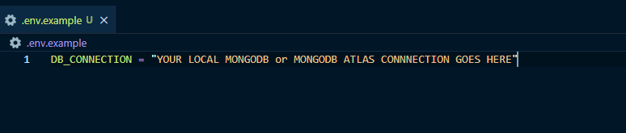

# My School Portfolio App - Back End

This repository is the Express.js - backend part of my portfolio app I built in 2019 after graduating from Bethel School of Technology with a Certificate in Web Development. In November 2021, I updated the project with some of my recent knowledge, including refactoring the project structure and further documentation of the project.

Click [here](https://github.com/benjaminchacko/My-Portfolio-App-Front-End) to explore the React JS - Front End.

### :scroll: License 
This repository is published under the terms of the [MIT license](https://github.com/benjaminchacko/React-Counter-App/blob/master/LICENSE).
© [Benjamin T. Chacko](https://GitHub.com/benjaminchacko), 2021

## How to Use
1. Fork this repository
2. Clone to your local machine
3. Create a .env file in root directory like this example: 

4. `yarn install` in your terminal to install node-modules
5. `yarn dev` to start Nodemon dev server
6. Use Postman, Insomnia or a similar tool to test API endpoints